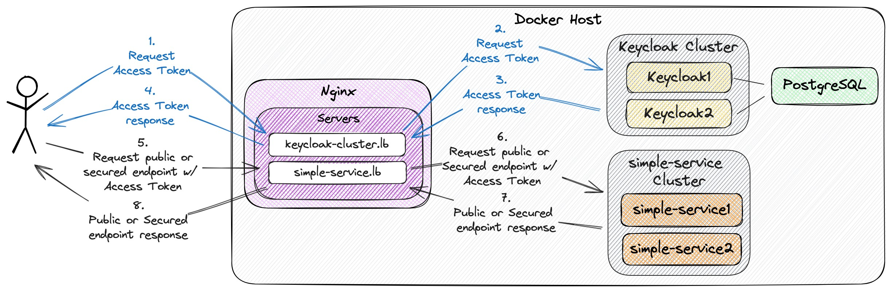

# spring-boot-nginx-keycloak-cluster

The goal of this project is to use [`Nginx`](https://nginx.org/en/) as a reverse proxy and load balancer for a [`Keycloak`](https://www.keycloak.org/) cluster with two instances and a [`Spring Boot`](https://docs.spring.io/spring-boot/docs/current/reference/htmlsingle/) application, called `simple-service`, also with two instances. The `simple-service` app will use `Keycloak` for IAM.

## Proof-of-Concepts & Articles

On [ivangfr.github.io](https://ivangfr.github.io), I have compiled my Proof-of-Concepts (PoCs) and articles. You can easily search for the technology you are interested in by using the filter. Who knows, perhaps I have already implemented a PoC or written an article about what you are looking for.

## Additional Readings

- \[**Medium**\] [**Using Nginx to Load Balance Requests to a Spring Boot Web application**](https://medium.com/@ivangfr/using-nginx-to-load-balance-requests-to-a-spring-boot-web-application-83a497a2f8ab)
- \[**Medium**\] [**Using Nginx to Load Balance Requests to a Keycloak Cluster**](https://medium.com/@ivangfr/using-nginx-to-load-balance-requests-to-a-keycloak-cluster-52174c89a0e4)
- \[**Medium**\] [**Nginx Load Balancing Requests to a Keycloak Cluster and a Spring Boot app that uses Keycloak as IAM**](https://medium.com/@ivangfr/nginx-load-balancing-requests-to-a-keycloak-cluster-and-a-spring-boot-app-that-uses-keycloak-as-iam-8e9e8280587d)

## Project Diagram



## Application

- ### simple-service

  `Spring Boot` Web Java application that exposes the following endpoints:
  - `GET /api/public`: This endpoint is not secured; everybody can access it;
  - `GET /api/secured`: This endpoint is secured and can only be accessed by users who provide a `JWT` access token issued by `Keycloak`. The token must contain the role `APP_USER`.

## Prerequisites

- [`Java 17+`](https://www.oracle.com/java/technologies/downloads/#java17)
- [`Docker`](https://www.docker.com/)
- [`jq`](https://stedolan.github.io/jq)

## Building simple-service Docker Image

- In a terminal, make sure you are inside the `spring-boot-nginx-keycloak-cluster` root folder.

- Run the following script:
  ```
  ./docker-build.sh
  ```

## Configure /etc/hosts

Add the line below to `/etc/hosts`
```
127.0.0.1 keycloak-cluster.lb simple-service.lb
```

## Starting Environment

Open a terminal and inside the `spring-boot-nginx-keycloak-cluster` root folder run:
```
./init-environment.sh
```

This script will start:
- one `PostgreSQL` Docker container;
- two `Keycloak` Docker containers;
- two `simple-service` Docker containers;
- one `Nginx` Docker container;

## Configuring Keycloak

We can configure a client for `simple-service` in `Keycloak` by using `Keycloak` website at http://keycloak-cluster.lb. However, to keep things simple and fast, we've created a script for it.

So, in a terminal, make sure you are inside the `spring-boot-nginx-keycloak-cluster` root folder, run the script below:
```
./init-keycloak.sh
```

The script will:
- create `company-services` realm;
- disable the required action `Verify Profile`;
- create `simple-service` client;
- create the client role `APP_USER` for the `simple-service` client;
- create `USERS` group;
- assign `APP_USER` client role to `USERS` group;
- create `user-test` user;
- assign `USERS` group to `user-test`;

To complete, copy the `SIMPLE_SERVICE_CLIENT_SECRET` value that is shown at the end of the script. It will be needed whenever we call `Keycloak` to get a `JWT` access token to access `simple-service`.

## Testing the simple-service endpoints

1. Open a new terminal;

2. Call the endpoint `GET /public`:
   ```
   curl -i http://simple-service.lb/public
   ```

   It should return:
   ```
   HTTP/1.1 200
   ...
   Hi World, I am a public endpoint
   ```

3. Try to call the endpoint `GET /secured` without authentication:
   ```
   curl -i http://simple-service.lb/secured
   ```

   It should return:
   ```
   HTTP/1.1 401
   ...
   ```

4. Create an environment variable that contains the `Client Secret` generated by `Keycloak` to `simple-service` at [Configure Keycloak](#configuring-keycloak) step:
   ```
   SIMPLE_SERVICE_CLIENT_SECRET=...
   ```

5. Run the command below to get an access token for `user-test` user:
   ```
   USER_TEST_ACCESS_TOKEN="$(curl -s -X POST \
     "http://keycloak-cluster.lb/realms/company-services/protocol/openid-connect/token" \
     -H "Content-Type: application/x-www-form-urlencoded" \
     -d "username=user-test" \
     -d "password=123" \
     -d "grant_type=password" \
     -d "client_secret=$SIMPLE_SERVICE_CLIENT_SECRET" \
     -d "client_id=simple-service" | jq -r .access_token)"
   echo $USER_TEST_ACCESS_TOKEN
   ```

6. Call the endpoint `GET /secured`:
   ```
   curl -i http://simple-service.lb/secured -H "Authorization: Bearer $USER_TEST_ACCESS_TOKEN"
   ```

   It should return:
   ```
   HTTP/1.1 200
   ...
   Hi user-test, I am a secured endpoint
   ```

7. The access token default expiration period is `5 minutes`. So, wait for this time and, using the same access token, try to call the secured endpoint.

   It should return:
   ```
   HTTP/1.1 401
   ...
   WWW-Authenticate: Bearer error="invalid_token", error_description="An error occurred while attempting to decode the Jwt: Jwt expired at ...", error_uri="https://tools.ietf.org/html/rfc6750#section-3.1"
   ...
   ```

8. Checking `Keycloak` and `simple-service` Docker container logs

   We can verify that `Nginx` is load balancing the requests appropriately when an access token request to `Keycloak` is made. To view the `Keycloak` Docker container logs, execute the following commands in different terminals:
   ```
   docker logs keycloak1 -f
   docker logs keycloak2 -f
   ```

   We can also verify that `Nginx` is appropriately load balancing requests to `simple-service` endpoints. To view the `simple-service` Docker container logs, execute the following commands in different terminals:
   ```
   docker logs simple-service1 -f
   docker logs simple-service2 -f
   ```

## Useful Links & Commands

- **Keycloak**
  
  The `Keycloak` website is at http://keycloak-cluster.lb

- **Nginx**

  If you wish to modify the `Nginx` configuration file without restarting its Docker container, follow these steps:
  
  - Apply the changes in the `nginx/nginx.conf` file;
  - Docker exec into the `nginx` Docker container
    ```
    docker exec -it nginx bash
    ```
  - In the `nginx` Docker container terminal, run:
    ```
    nginx -s reload
    ```
  - To exit, just run the command `exit`.

## Shutdown

To stop and remove docker containers, network and volumes, go to a terminal and inside the `spring-boot-nginx-keycloak-cluster` root folder, run the following script:
```
./shutdown-environment.sh
```

## Cleanup

To remove the `simple-service` Docker image created, simply go to a terminal and run the following script:
```
./remove-docker-images.sh
```